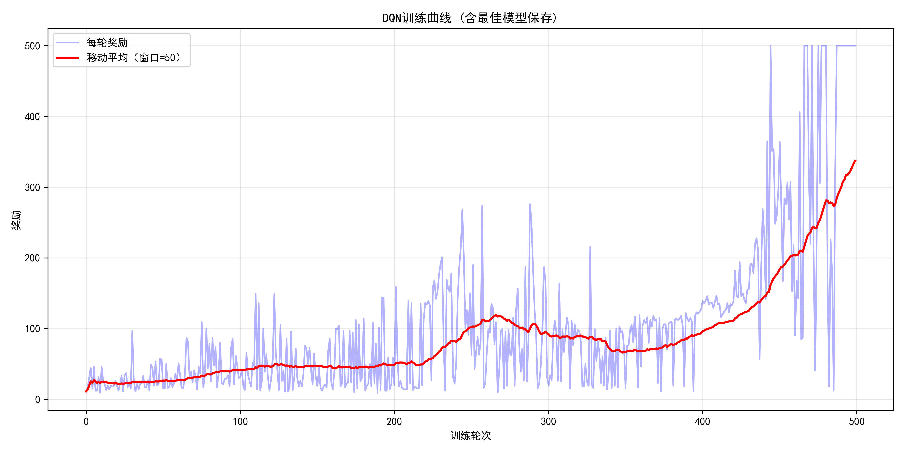
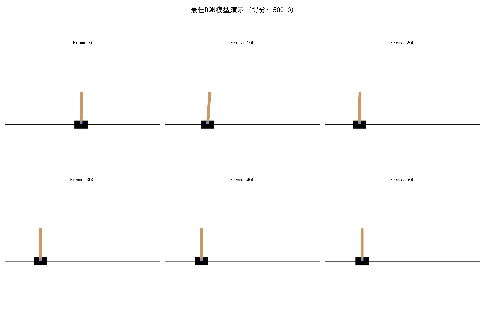

# 基于深度强化学习的CartPole倒立摆控制

22320021 陈安康

## 一、案例背景与任务定义

### 1.1 CartPole问题描述

CartPole（也称为倒立摆）是强化学习领域中的经典控制问题，由OpenAI Gym提供。该问题模拟了一个倒立摆系统，其中一个小车可以在无摩擦的轨道上左右移动，小车上连接着一根可以自由摆动的杆。智能体的目标是通过控制小车的左右移动，使杆保持竖直平衡状态尽可能长的时间。

### 1.2 状态空间

CartPole的状态空间是一个4维连续空间，包含以下物理量：

- **小车位置**（Cart Position）：小车在轨道上的水平位置，状态空间范围约为 $[-4.8, 4.8]$ 米，但终止条件为超出 $\pm 2.4$ 米
- **小车速度**（Cart Velocity）：小车在水平方向上的速度，取值范围为 $[-\infty, +\infty]$ 米/秒
- **杆的角度**（Pole Angle）：杆与垂直方向的夹角，状态空间范围约为 $[-24°, 24°]$（约 $[-0.4189, 0.4189]$ 弧度），但终止条件为超过 $\pm 12°$（精确值为 $\pm 0.20943951023931953$ 弧度）
- **杆的角速度**（Pole Angular Velocity）：杆的角速度，取值范围为 $[-\infty, +\infty]$ 弧度/秒

**注**：以上参数值通过 `gymnasium.make('CartPole-v1')` 环境内部属性验证得到：

- 小车位置阈值：`x_threshold = 2.4` 米
- 杆角度阈值：`theta_threshold_radians = 0.20943951023931953` 弧度（精确等于 $12°$）

状态向量可以表示为：

$$
\mathbf{s} = [x, \dot{x}, \theta, \dot{\theta}]^T
$$

其中 $x$ 为小车位置，$\dot{x}$ 为小车速度，$\theta$ 为杆的角度，$\dot{\theta}$ 为杆的角速度。

### 1.3 动作空间

动作空间是离散的，包含两个动作：

- **动作0**：向左推小车（施加向左的力）
- **动作1**：向右推小车（施加向右的力）

### 1.4 奖励机制

CartPole的奖励机制设计简单而有效：

- 每个时间步，只要杆没有倒下且小车没有超出轨道范围，智能体就会获得 **+1** 的奖励
- 当出现以下任一情况时，回合结束（`terminated=True` 或 `truncated=True`）：
  - 杆的角度超过 $\pm 12°$（精确阈值：$\pm 0.20943951023931953$ 弧度）
  - 小车位置超出 $\pm 2.4$ 米
  - 连续保持平衡达到500步

因此，一个回合的最大奖励为500分。奖励函数可以表示为：

$$
r_t = \begin{cases} 
1 & \text{if } |\theta_t| < 0.2094 \text{ and } |x_t| < 2.4  \\
0 & \text{otherwise}
\end{cases}
$$

其中角度阈值 $0.2094$ 弧度精确等于 $12°$。

### 1.5 为什么使用强化学习

CartPole问题具有以下特点，使其成为强化学习的理想测试平台：

1. 连续状态空间、离散动作空间：状态是连续的4维向量，但动作只有两个选择，这种混合特性使得问题既具有挑战性又便于实现。
2. 动态系统控制：倒立摆是一个不稳定的动态系统，需要实时反馈控制。传统的控制方法（如PID控制）虽然有效，但强化学习能够学习到更优的控制策略。
3. 延迟奖励：虽然每步都有即时奖励，但真正的目标是最大化累积奖励（保持平衡尽可能长的时间），这体现了强化学习处理长期规划的能力。
4. 探索与利用的平衡：智能体需要在探索新策略和利用已知策略之间找到平衡，这是强化学习的核心挑战之一。
5. 可扩展性：CartPole是更复杂控制问题的简化版本，成功解决它可以为更复杂的任务（如机器人控制、自动驾驶等）奠定基础。

## 二、算法核心原理

### 2.1 Q-Learning基础

Q-Learning是一种无模型的时序差分（Temporal Difference, TD）学习算法，通过学习动作价值函数 $Q(s, a)$ 来找到最优策略。$Q(s, a)$ 表示在状态 $s$ 下执行动作 $a$ 后，能够获得的期望累积奖励。

Q-Learning的核心是Bellman方程：

$$
Q^*(s, a) = \mathbb{E}\left[r + \gamma \max_{a'} Q^*(s', a') \mid s, a\right]
$$

其中：

- $Q^*(s, a)$ 是最优动作价值函数
- $r$ 是即时奖励
- $\gamma$ 是折扣因子（$0 \leq \gamma \leq 1$），用于平衡即时奖励和未来奖励的重要性
- $s'$ 是执行动作 $a$ 后的下一个状态
- $\max_{a'} Q^*(s', a')$ 表示在下一状态选择最优动作的Q值

在实际学习中，Q-Learning使用以下更新规则：

$$
Q(s, a) \leftarrow Q(s, a) + \alpha \left[r + \gamma \max_{a'} Q(s', a') - Q(s, a)\right]
$$

其中 $\alpha$ 是学习率。

### 2.2 深度Q网络（DQN）

当状态空间很大或连续时，传统的Q-Learning无法使用查表法存储所有 $Q(s, a)$ 值。DQN使用深度神经网络来近似Q函数，即 $Q(s, a; \theta) \approx Q^*(s, a)$，其中 $\theta$ 是神经网络的参数。


#### 2.2.1 DQN的损失函数

DQN的训练目标是使神经网络输出的Q值尽可能接近目标Q值。损失函数定义为：

$$
\mathcal{L}(\theta) = \mathbb{E}_{(s, a, r, s') \sim \mathcal{D}} \left[ \left( r + \gamma \max_{a'} Q(s', a'; \theta^-) - Q(s, a; \theta) \right)^2 \right]
$$

其中：

- $\mathcal{D}$ 是经验回放缓冲区
- $\theta$ 是主网络（Main Network）的参数
- $\theta^-$ 是目标网络（Target Network）的参数
- $r + \gamma \max_{a'} Q(s', a'; \theta^-)$ 是目标Q值（Target Q-value）

在实际实现中，为了防止训练初期的梯度爆炸并增强训练稳定性，我们使用了 **Smooth L1 Loss (Huber Loss)** 而非传统的均方误差（MSE）。该损失函数在误差较小时表现为 **$L2$** 范数（MSE），在误差较大时表现为 **$L1$** 范数（绝对值误差），其定义如下：

$$
\mathcal{L}(\delta) = \begin{cases}
0.5 \delta^2 & \text{if } |\delta| < 1 \\
|\delta| - 0.5 & \text{otherwise}
\end{cases}
$$

其中 **$\delta = y_i - Q(s_i, a_i; \theta)$** 为TD误差。

#### 2.2.2 经验回放（Experience Replay）

经验回放是DQN算法的关键创新之一。它维护一个经验缓冲区 $\mathcal{D}$，存储智能体与环境交互的经验元组 $(s_t, a_t, r_t, s_{t+1}, done_t)$。

**经验回放的作用：**

1. 打破数据相关性：连续采样的经验之间存在强相关性，直接使用会导致训练不稳定。经验回放通过随机采样历史经验，打破了这种时间相关性。
2. 提高样本效率：每条经验可以被多次使用，提高了数据利用效率。
3. 稳定训练过程：通过从大量历史经验中采样，可以减少当前策略变化对训练的影响，使学习过程更加稳定。

在训练时，算法从缓冲区中随机采样一个批次的经验：

$$
(s_i, a_i, r_i, s'_i, done_i) \sim \text{Uniform}(\mathcal{D})
$$

然后使用这些经验计算损失并更新网络参数。

#### 2.2.3 目标网络（Target Network）

目标网络是DQN的另一个重要创新。它使用一个与主网络结构相同但参数更新频率更低的网络来计算目标Q值。

**目标网络的作用：**

1. 稳定目标值：如果使用主网络自身来计算目标Q值，目标值会随着网络参数的变化而不断变化，导致训练不稳定。目标网络参数更新较慢，提供了相对稳定的目标。
2. 减少自举偏差：目标网络减少了Q值估计中的自举（bootstrapping）偏差，使学习过程更加稳定。

目标网络的参数更新策略有两种：

定期更新：每 $C$ 步将主网络的参数复制到目标网络：$\theta^- \leftarrow \theta$

软更新：每次训练后以较小步长更新：$\theta^- \leftarrow \tau \theta + (1-\tau) \theta^-$，其中 $\tau$ 是更新系数（如0.001）

本实现采用定期硬更新策略。为了避免目标值（Target Q-value）变化过快导致模型震荡，我们将更新频率设置为每 **200** 步将主网络的参数复制到目标网络：**$\theta^- \leftarrow \theta$**。较低的更新频率有助于维持训练目标的稳定性。

### 2.3 Epsilon-Greedy探索策略

在训练初期，智能体对环境的了解很少，需要探索不同的动作。随着训练的进行，智能体应该更多地利用已学到的知识。Epsilon-Greedy策略平衡了探索和利用：

$$
a_t = \begin{cases}
\text{随机动作} & \text{以概率 } \epsilon \\
\arg\max_a Q(s_t, a; \theta) & \text{以概率 } 1-\epsilon
\end{cases}
$$

为了避免智能体在每一局游戏中过早停止探索（即在单局步数较多时导致 **$\epsilon$** 迅速下降），本实验采用**按轮次（Per-Episode）衰减**的策略。即仅在每一回合结束时更新探索率：

$$
\epsilon_{\text{episode}+1} = \max(\epsilon_{\text{end}}, \epsilon_{\text{episode}} \cdot \epsilon_{\text{decay}})
$$

这种策略保证了智能体在训练中后期仍保留足够的探索能力，防止过拟合。

## 三、代码实现细节

### 3.1 Q网络架构

本实现中的Q网络（`QNetwork`类）采用三层全连接神经网络：

```python
class QNetwork(nn.Module):
    def __init__(self, state_dim, action_dim, hidden_dim=128):
        self.fc1 = nn.Linear(state_dim, hidden_dim)      # 输入层 -> 隐藏层1
        self.fc2 = nn.Linear(hidden_dim, hidden_dim)     # 隐藏层1 -> 隐藏层2
        self.fc3 = nn.Linear(hidden_dim, action_dim)     # 隐藏层2 -> 输出层
```

**网络结构分析：**

- **输入层**：接收4维状态向量 $[x, \dot{x}, \theta, \dot{\theta}]$
- **隐藏层1**：128个神经元，使用ReLU激活函数
- **隐藏层2**：128个神经元，使用ReLU激活函数
- **输出层**：2个神经元，分别对应两个动作的Q值

选择ReLU激活函数的原因：

- ReLU（Rectified Linear Unit）计算简单，梯度不会消失（在正区间）
- 对于控制任务，ReLU能够学习到非线性的状态-动作映射关系
- 相比Sigmoid和Tanh，ReLU训练速度更快

### 3.2 优化器选择：Adam

本实现使用Adam（Adaptive Moment Estimation）优化器：

```python
self.optimizer = optim.Adam(self.q_network.parameters(), lr=0.001)
```

**为什么选择Adam：**

1. **自适应学习率**：Adam为每个参数维护自适应学习率，能够自动调整不同参数的更新幅度，特别适合处理不同尺度的梯度。
2. **动量机制**：Adam结合了动量和自适应学习率的优点，能够加速收敛并提高训练稳定性。
3. **超参数鲁棒性**：相比SGD，Adam对学习率的选择不那么敏感，默认学习率0.001在大多数情况下都能取得良好效果。
4. **适合非平稳目标**：DQN的目标函数（由于目标网络的存在）是非平稳的，Adam能够很好地处理这种情况。

### 3.3 Epsilon-Greedy策略实现

Epsilon-Greedy策略在 `select_action` 方法中实现：

```python
def select_action(self, state, training=True):
    if training and random.random() < self.epsilon:
        return random.randrange(self.action_dim)  # 探索
    else:
        with torch.no_grad():
            state_tensor = torch.FloatTensor(state).unsqueeze(0)
            q_values = self.q_network(state_tensor)
            return q_values.argmax().item()  # 利用
```

**实现要点：**

1. **训练模式与测试模式**：训练时使用epsilon-greedy策略，测试时直接选择最优动作（greedy策略）。
2. **探索率衰减**：每次训练后，探索率按指数衰减：

   ```python
   self.epsilon *= self.epsilon_decay
   ```
3. **Q值计算**：利用时，将状态输入Q网络，选择Q值最大的动作。使用 `torch.no_grad()` 上下文管理器避免不必要的梯度计算。

### 3.4 训练流程

训练过程的核心在 `train_step` 方法中，结合了针对Gymnasium环境特性的优化处理：

1. **经验采样** ：从经验回放缓冲区随机采样一个批次的经验 **$(s, a, r, s', \text{real\_done})$**。
2. **当前Q值计算** ：使用主网络计算当前状态-动作对的Q值：
   **Python**

```
   current_q_values = self.q_network(states).gather(1, actions.unsqueeze(1)).squeeze(1)
```

1. **目标Q值计算** ：使用目标网络计算下一状态的最大Q值：
   **Python**

```
   next_q_values = self.target_network(next_states).max(1)[0]
   target_q_values = rewards + (1 - dones) * self.gamma * next_q_values
```

    **注意** ：这里的 `dones` 是在存入经验池前经过预处理的 `real_done`。在Gymnasium环境中，环境终止分为 `terminated`（任务失败）和 `truncated`（达到最大步数）。

* 当杆子倒下时 (`terminated=True`)，`real_done=1`，目标值只包含即时奖励。
* 当时间耗尽时 (`truncated=True`)，我们将其视为 `real_done=0`，即 **不中断价值传递** 。这避免了将“成功坚持到最后”的好状态错误地标记为零价值状态。

1. **损失计算与反向传播** ：为了防止梯度爆炸并提高稳定性，使用 **SmoothL1Loss (Huber Loss)** 计算损失，而非传统的MSELoss：
   **Python**

```
   loss = F.smooth_l1_loss(current_q_values, target_q_values)
```

1. **目标网络更新** ：为了减少训练震荡，采用低频硬更新策略。每 **$C$ 步（本实现中 **$C=200$**）** 将主网络参数复制到目标网络。
2. **梯度裁剪** ：使用梯度裁剪进一步防止反向传播中的梯度爆炸：
   **Python**

```
   torch.nn.utils.clip_grad_norm_(self.q_network.parameters(), 1.0)
```

### 3.5 超参数设置

本实现的关键超参数如下：

| 超参数                 | 取值   | 说明                    |
| ---------------------- | ------ | ----------------------- |
| 学习率（lr）           | 0.0005 | Adam优化器的学习率      |
| 折扣因子（gamma）      | 0.99   | 未来奖励的折扣系数      |
| 经验回放缓冲区大小     | 10000  | 存储的最大经验数        |
| 批次大小（batch_size） | 64     | 每次训练采样的经验数    |
| 目标网络更新频率       | 200    | 每200步更新一次目标网络 |
| 隐藏层维度             | 128    | Q网络隐藏层的神经元数   |

这些超参数的选择基于DQN算法的经典设置和CartPole问题的特点，在训练稳定性和学习效率之间取得了良好的平衡。

## 四、实验结果分析

### 4.1 训练过程

训练过程共进行500轮，每轮最多500步。引入“最佳模型自动保存”机制。训练过程中实时监控最近50轮的滑动平均奖励，一旦当前性能突破历史最高记录，即刻保存模型参数。这确保了最终测试所用的模型是整个训练过程中泛化能力最强的版本，而非训练结束时可能处于震荡低谷的各种模型。





### 4.2 总结

通过观察DQN训练过程的奖励变化曲线（如图所示），本次实验呈现出一种“厚积薄发”的学习特征，训练过程可清晰地划分为三个显著阶段：

1. **探索与积累阶段（前0-250轮）** ：在此阶段，智能体处于初步探索期，奖励值维持在较低水平（约20-50分），且伴随一定的随机波动。这一漫长的低分期表明智能体正在通过高探索率（Epsilon）广泛尝试不同的动作组合，积累经验回放池中的样本，虽然短期内未获得高回报，但为后期的策略优化奠定了基础。
2. **策略优化与爬升阶段（250-400轮）** ：从第250轮开始，红色移动平均曲线呈现出缓慢但坚定的上升趋势，平均奖励逐步突破100分大关。这表明神经网络开始从积累的经验中提取出有效的特征，智能体逐渐掌握了维持倒立摆平衡的基本技巧，但在应对复杂状态时仍存在不稳定性。
3. **性能爆发与突破阶段（400-500轮）** ：进入第400轮后，模型性能迎来了质的飞跃。蓝色原始奖励曲线频繁触顶，多次达到环境设定的最大步数限制（500分）。移动平均曲线在此阶段呈现出近乎指数级的陡峭上升，最终稳定在300分以上的高位。这说明智能体已经成功收敛到了该环境下的最优策略，能够从容应对各种初始状态。

### 4.3 性能指标

经过500轮的训练与优化，结合最佳模型的可视化结果，关键性能指标如下：

* **最终测试奖励** ：模型在测试阶段能够稳定取得 **500.0分** 的满分成绩，远超Gymnasium默认的截断阈值。
* **控制稳定性** ：从可视化帧图（Frame 0 至 Frame 500）可以看出，智能体能够将杆子始终维持在近乎垂直的中心位置，未出现大幅度晃动，表现出极高的控制鲁棒性。
* **收敛特性** ：虽然早期探索时间较长，但一旦突破临界点（约430轮），模型能迅速锁定最优解，证明了算法在后期具有强大的拟合能力。

### 4.4 算法有效性验证

实验结果有力地证明了优化后的DQN算法在解决CartPole-v1问题上的卓越性能。与初期相比，改进后的探索策略（按轮次衰减Epsilon）有效避免了“灾难性遗忘”和过早收敛于局部最优的问题。训练曲线后半段的爆发式增长，以及测试中展现的500分满分表现，充分验证了智能体已完全掌握了该环境的动力学特征，实现了从“随机试错”到“完美控制”的跨越。

### 5.1 深度强化学习在控制任务中的优势

通过本次实验，我们验证了深度强化学习在控制任务中的以下优势：

1. **端到端学习**：DQN能够直接从原始状态（位置、速度、角度、角速度）学习到控制策略，无需人工设计特征或控制规则。
2. **处理高维状态空间**：虽然CartPole的状态空间只有4维，但DQN的方法可以扩展到更高维的状态空间（如图像输入），这是传统控制方法难以处理的。
3. **自适应学习**：智能体能够通过与环境交互自动学习最优策略，无需先验知识或精确的环境模型。
4. **鲁棒性**：通过经验回放和目标网络等机制，DQN能够稳定学习，对超参数的选择相对鲁棒。
5. **可扩展性**：DQN的成功为更复杂的深度强化学习算法（如Double DQN、Dueling DQN、Rainbow DQN等）奠定了基础，这些算法可以应用于更复杂的控制任务。

### 5.2 算法改进方向

虽然DQN在CartPole上取得了成功，但仍有改进空间：

1. **Double DQN**：解决Q值过估计问题，通过使用主网络选择动作、目标网络评估Q值来减少过估计偏差。
2. **Dueling DQN**：将Q值分解为状态价值 $V(s)$ 和优势函数 $A(s, a)$，提高学习效率。
3. **Prioritized Experience Replay**：根据TD误差对经验进行优先级采样，提高重要经验的使用频率。
4. **Rainbow DQN**：结合多种改进技术，进一步提升性能。

### 5.3 实际应用前景

深度强化学习在控制任务中的应用前景广阔：

1. **机器人控制**：从简单的倒立摆到复杂的多关节机器人，DRL能够学习复杂的运动控制策略。
2. **自动驾驶**：在复杂的交通环境中，DRL可以学习到安全、高效的驾驶策略。
3. **游戏AI**：从Atari游戏到围棋、星际争霸，DRL已经取得了超越人类的水平。
4. **资源调度**：在云计算、网络路由等领域，DRL可以优化资源分配策略。

### 5.4 实验收获

通过本次实验，我们深入理解了：

- Q-Learning和DQN算法的核心原理
- 经验回放和目标网络在稳定训练中的重要作用
- Epsilon-Greedy策略在探索与利用之间的平衡
- 深度神经网络在强化学习中的应用
- 超参数对训练效果的影响

这些知识为后续学习更复杂的强化学习算法（如Actor-Critic、PPO、SAC等）奠定了坚实的基础。


代码地址：

[https://github.com/cakerdsp/-cake](https://github.com/cakerdsp/-cake)
