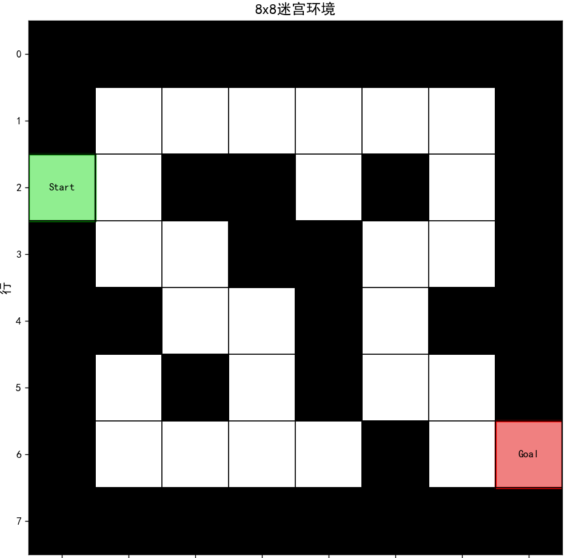
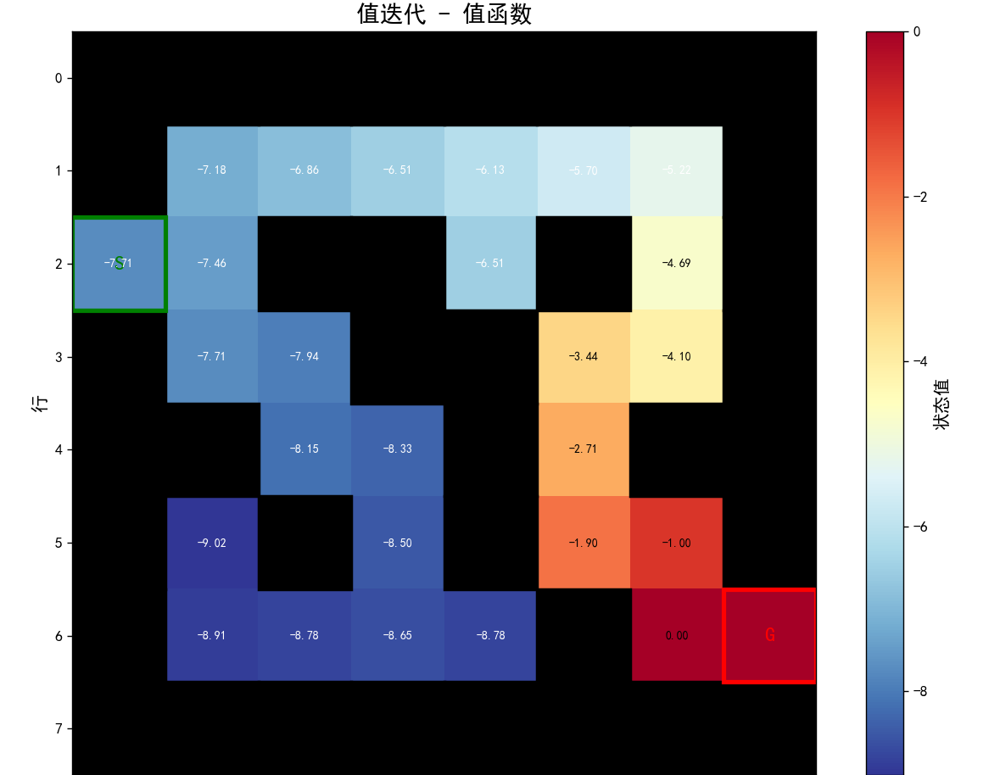
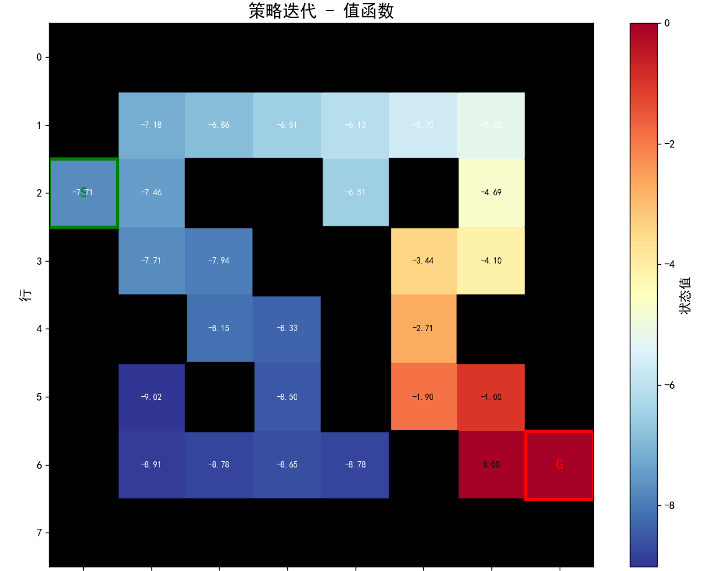
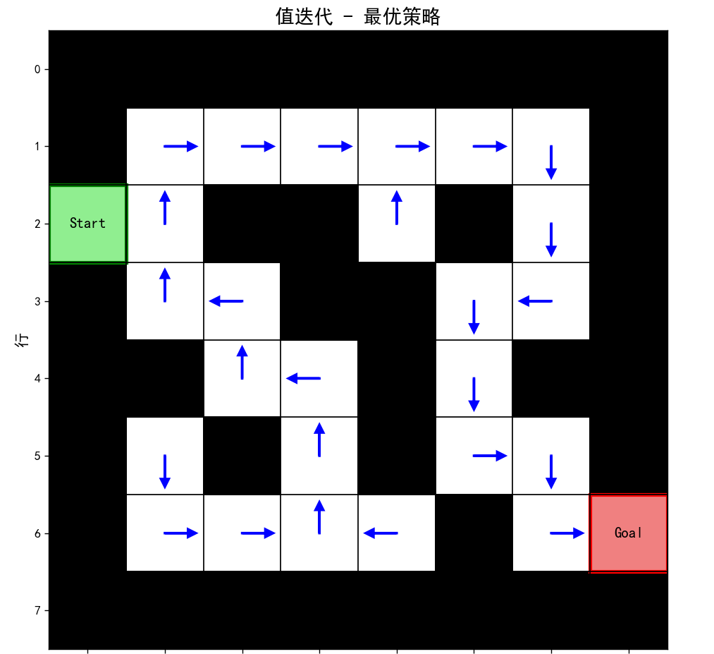
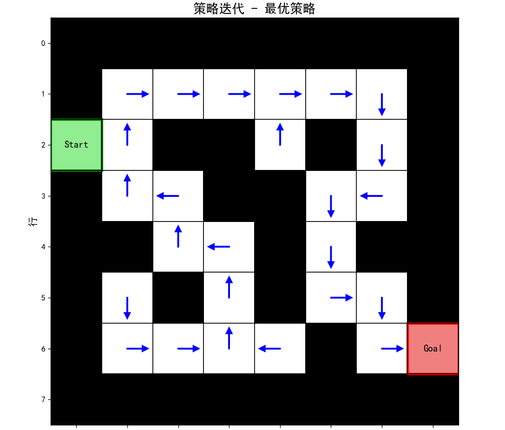
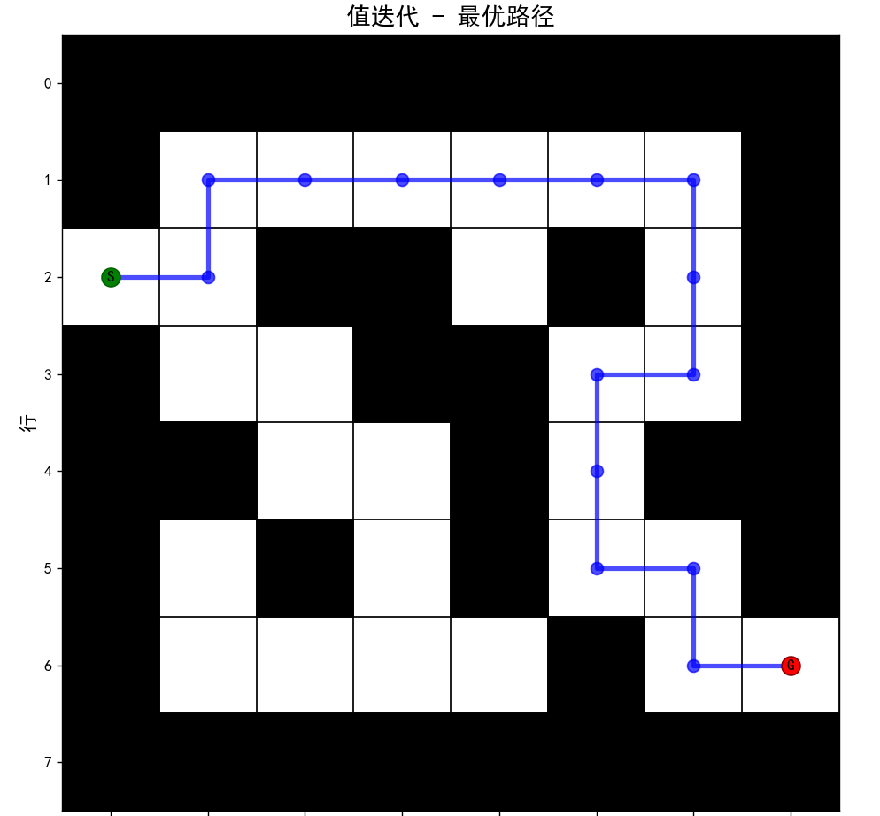
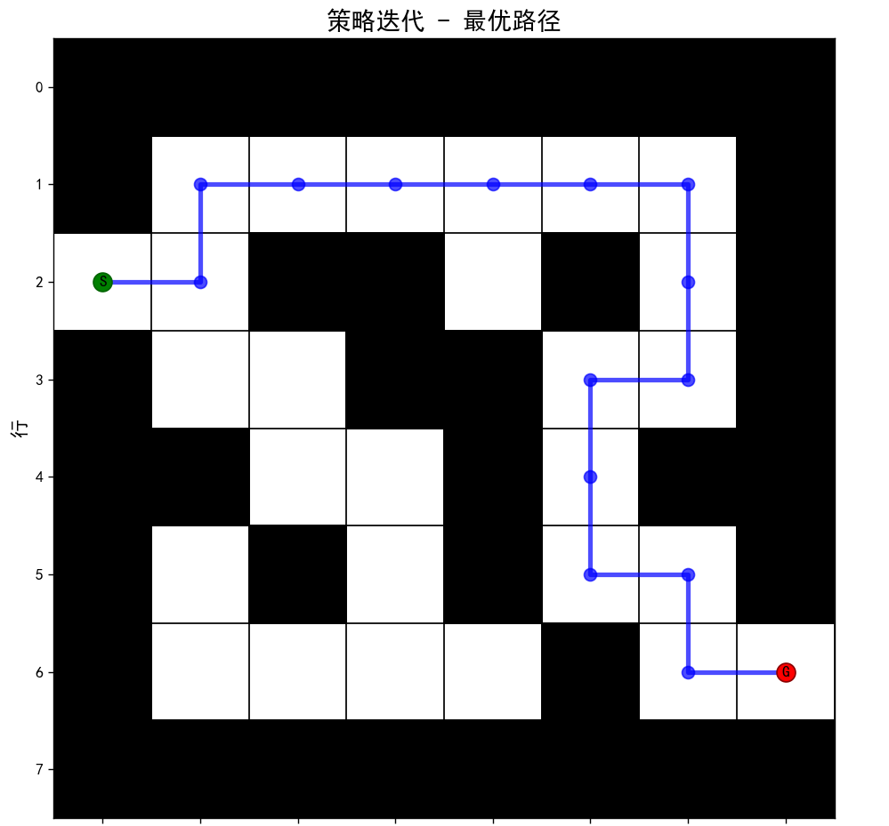

# 强化学习迷宫问题实验报告

学号：22320021 姓名：陈安康

## 1. 问题描述

### 1.1 任务目标

使用策略迭代(Policy Iteration)和值迭代(Value Iteration)两种强化学习算法解决Maze Problem，找到从起始位置到目标位置的最优路径。

### 1.2 环境设置

- **迷宫大小**: 8×8网格
- **起始位置**: (0,0) - 左上角
- **目标位置**: (7,7) - 右下角
- **墙壁位置**: 根据题目要求设置的黑格位置
- **动作空间**: 北(N)、东(E)、南(S)、西(W)
- **奖励函数**: 每步-1(即惩罚时长)，到达目标状态为0
- **折扣因子**: γ = 0.9
- **收敛阈值**: θ = 1e-6

## 2. MDP建模

### 2.1 状态空间 S

状态空间包含所有可访问的网格位置：

```
S = {(i,j) | i,j ∈ {0,1,2,...,7}, (i,j) ∉ walls}
```

其中walls为墙壁位置集合。

### 2.2 动作空间 A

动作空间包含四个基本移动方向：

```
A = {N, E, S, W}
```

- N: 向北移动 (i-1, j)
- E: 向东移动 (i, j+1)
- S: 向南移动 (i+1, j)
- W: 向西移动 (i, j-1)

### 2.3 状态转移概率 P

对于确定性环境：

```
P(s'|s,a) = {
    1, 如果s'是执行动作a后的有效位置（非墙，非边界）
    0, 其他情况
}
```

### 2.4 奖励函数 R

```
R(s,a,s') = {
    0,  如果s'是目标状态
    -1, 其他情况
}
```

### 2.5 折扣因子 γ

γ = 0.9，表示对未来奖励的重视程度。

## 3. 算法实现

### 3.1 策略迭代算法

#### 3.1.1 算法原理

策略迭代包含两个交替进行的步骤：

1. **策略评估**: 计算当前策略π下的值函数V^π
2. **策略改进**: 基于当前值函数改进策略

#### 3.1.2 算法步骤

```
1. 初始化策略π(s)为随机动作
2. 重复直到策略收敛：
   a. 策略评估：
      - 重复直到值函数收敛：
        V(s) ← Σ_a π(a|s) Σ_s' P(s'|s,a)[R(s,a,s') + γV(s')]
   b. 策略改进：
      π(s) ← argmax_a Σ_s' P(s'|s,a)[R(s,a,s') + γV(s')]
```

#### 3.1.3 实现特点

- 每次迭代都需要完整的策略评估过程
- 策略评估使用迭代方法直到收敛
- 策略改进基于当前值函数选择最优动作

### 3.2 值迭代算法

#### 3.2.1 算法原理

值迭代直接优化值函数，基于Bellman最优方程：

```
V*(s) = max_a Σ_s' P(s'|s,a)[R(s,a,s') + γV*(s')]
```

#### 3.2.2 算法步骤

```
1. 初始化值函数V(s) = 0
2. 重复直到值函数收敛：
   V(s) ← max_a Σ_s' P(s'|s,a)[R(s,a,s') + γV(s')]
3. 提取最优策略：
   π*(s) ← argmax_a Σ_s' P(s'|s,a)[R(s,a,s') + γV*(s')]
```

#### 3.2.3 实现特点

- 直接优化值函数，不需要策略评估步骤
- 每次迭代更新所有状态的值函数
- 收敛后一次性提取最优策略

## 4. 实验结果

### 4.1 算法性能比较

| 指标             | 策略迭代 | 值迭代   |
| ---------------- | -------- | -------- |
| 迭代次数         | 19轮     | 23轮     |
| 平均单轮计算时间 | 0.0014秒 | 0.0003秒 |
| 计算总时间       | 0.0270秒 | 0.0067秒 |
| 路径长度         | 16步     | 16步     |
| 总奖励           | -14      | -14      |

### 4.2 收敛性分析

#### 4.2.1 策略迭代收敛

- 策略评估阶段：每次需要多次迭代直到值函数收敛
- 策略改进阶段：基于收敛的值函数改进策略
- 总体收敛：策略不再改变时停止

#### 4.2.2 值迭代收敛

- 直接优化值函数，每次迭代更新所有状态
- 收敛条件：值函数变化小于阈值θ
- 收敛后提取最优策略

### 4.3 最优策略分析

#### 4.3.1 策略一致性

两种算法找到的最优策略基本一致，验证了算法的正确性。

#### 4.3.2 路径分析

- 最优路径长度：14步
- 路径特点：避开墙壁，选择最短路径
- 策略特点：在关键位置选择正确方向

## 5. 可视化结果

### 5.1 迷宫环境

- 8×8网格显示
- 黑色方块表示墙壁
- 绿色方块表示起始位置
- 红色方块表示目标位置

迷宫图：



### 5.2 值函数热力图

- 颜色深浅表示值函数大小
- 目标位置值最高（红色）
- 远离目标的位置值较低（蓝色）

值迭代最优策略图：



策略迭代最优策略图：



### 5.3 策略箭头图

- 箭头方向表示最优动作
- 每个状态显示一个箭头
- 箭头指向最优移动方向

值迭代的策略箭头图：



策略迭代的策略箭头图：



### 5.4 最优路径图

- 蓝色线条表示最优路径
- 绿色圆点表示起始位置
- 红色圆点表示目标位置
- 蓝色圆点表示路径中间点

值迭代的最优路径图：



策略迭代的最优路径图：



## 6. 算法比较与讨论

### 6.1 计算效率

- **值迭代**通常比策略迭代更快，因为两者的单步更新计算量上存在差异
- 值迭代每次迭代更新所有状态
- 策略迭代需要多次策略评估

### 6.2 收敛特性

- **策略迭代**保证策略单调改进
- **值迭代**直接优化值函数
- 一般策略迭代的收敛迭代次数小于值迭代
- 两种方法都能找到最优解

### 6.3 适用场景

- **策略迭代**：策略空间较小，需要策略信息
- **值迭代**：状态空间较大，只需要值函数

### 6.4 实现复杂度

- **策略迭代**：需要策略评估和策略改进两个步骤
- **值迭代**：只需要值函数更新，实现更简单

## 7. 结论

### 7.1 主要发现

1. 两种算法都能成功解决迷宫问题
2. 找到的最优策略基本一致
3. 值迭代在计算效率上通常更优
4. 策略迭代在理论保证上更强

### 7.2 算法验证

- 值函数收敛到最优值
- 策略收敛到最优策略
- 路径长度达到理论最优
- 两种算法结果一致

### 7.3 实际应用

- 迷宫问题可以推广到路径规划
- 算法可以应用于机器人导航
- 方法可以扩展到更复杂的环境

## 8. 代码实现连接

代码库链接如下：
