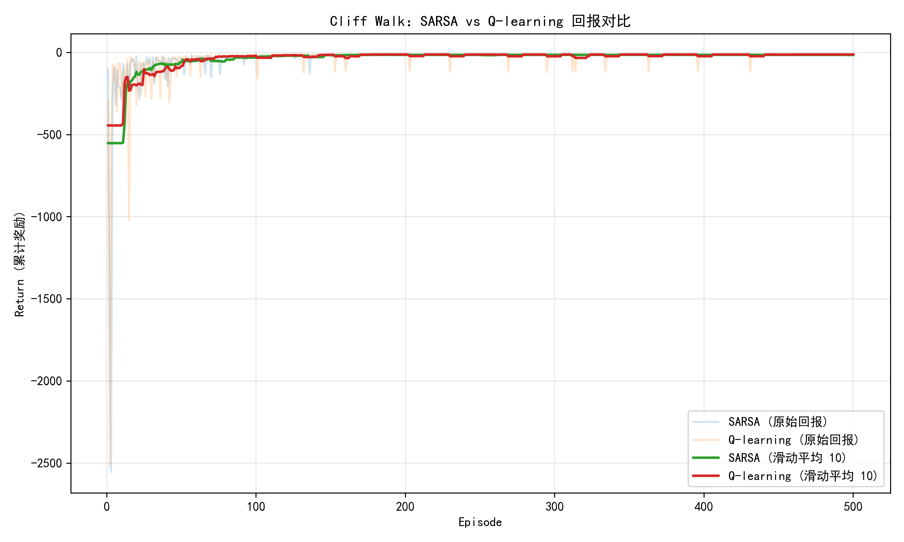
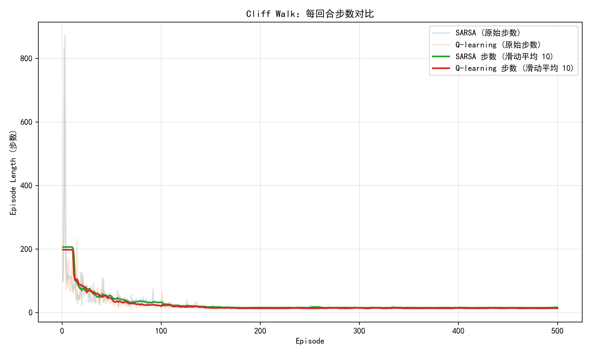
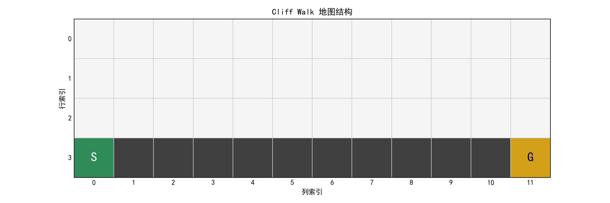
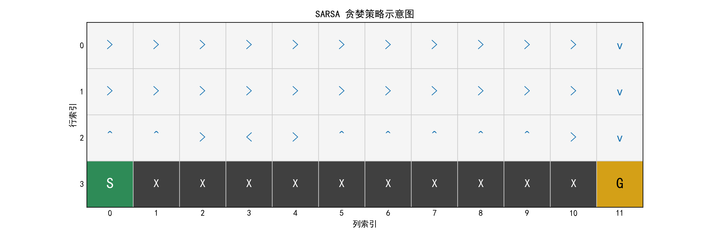
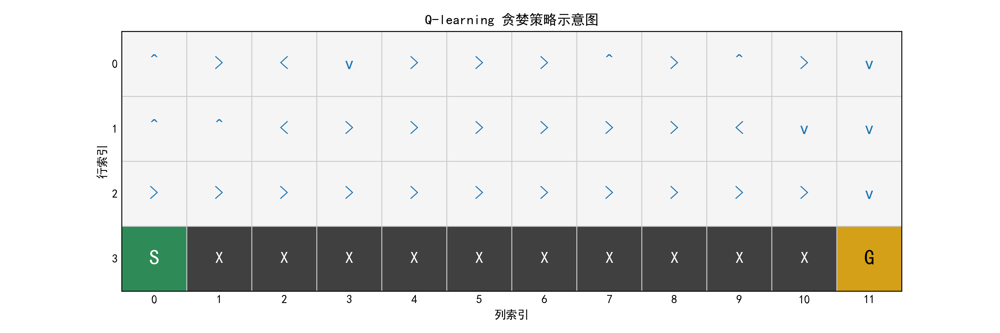

# Cliff Walk 强化学习实验报告

学号：22320021 姓名：陈安康

## 1. 项目背景与任务描述

本次实验围绕经典的 Cliff Walk（悬崖漫步）强化学习任务展开，旨在实现并比较基于表格型方法的两种时序差分控制算法：SARSA 与 Q-learning。实验目标包括：

1. 自行实现 Cliff Walk 网格世界环境；
2. 分别使用 SARSA 与 Q-learning 训练智能体，比较学习性能与策略差异；
3. 通过实验数据与可视化图表展示不同算法在回报与收敛速度方面的表现；

环境说明：

Cliff Walk 任务起点位于左下角，终点位于右下角，沿下边中间一段为悬崖。智能体每移动一步奖励为 -1，跌落悬崖会立即受到 -100 惩罚并回到起点继续。该任务能够突出 SARSA（on-policy）与 Q-learning（off-policy）在风险偏好上的差异：前者倾向于学习到更安全的路径，而后者追求期望回报最大化，往往选择经过悬崖边缘的捷径。

## 2. Cliff Walk 环境设计

### 2.1 状态与动作空间

- **状态**：采用 4×12 的离散网格，共 48 个可辨别格子，使用 `(row, col)` 表示，内部实现通过行主序编码映射为 `state_id = row * 12 + col`；
- **动作**：上下左右四种离散动作，分别记为 `0~3`；
- **起点**：`(3, 0)`；**终点**：`(3, 11)`；**悬崖区域**：`(3, 1) ~ (3, 10)`。

### 2.2 状态转移与奖励函数

1. 智能体执行动作后尝试移动一个单位；
2. 若超出边界，则停留在原地；
3. 若落入悬崖区域，则获得 `-100` 并回到起点，回合继续；
4. 若到达终点，则回合终止，奖励 `-1`；
5. 普通有效移动奖励为 `-1`。

环境实现位于 `cliff_walk_env.py`，主要方法包括：

- `reset()`：重置环境并返回起点；
- `step(action)`：执行动作并返回 `Transition(next_state, reward, terminated)`；
- `state_to_index(state)` 与 `index_to_state(index)`：用于 Q 表索引；
- `render_ascii(agent_state)`：提供 ASCII 可视化便于调试；
- `seed_everything(seed)`：统一设置 NumPy 随机种子，确保可重复性。

### 2.3 设计要点

为便于算法通用性，环境类提供以下特性：

- 使用 `dataclass Transition` 封装转移信息，包含下一状态、奖励和终止标记；
- 将网格状态映射为线性索引，方便表格型算法直接操作；
- 对非法动作进行了显式检查，避免调试时的 silent failure；
- 提供合法状态列表与 ASCII 渲染接口，支持策略可视化与结果分析。

关键一步的转移逻辑如下，展示了悬崖回传与终点处理：

```65:89:cliff_walk_env.py
    def step(self, action: Action) -> Transition:
        if action not in self.ACTIONS:
            raise ValueError(f"非法动作 {action}，应在 0~{len(self.ACTIONS) - 1} 之间。")

        if self._state == self._terminal_state:
            return Transition(self._state, 0.0, True)

        move = self.ACTIONS[action]
        next_state = self._move(self._state, move)

        if next_state in self._cliff_states:
            reward = -100.0
            self._state = self._start_state
            terminated = False
        elif next_state == self._terminal_state:
            reward = -1.0
            self._state = next_state
            terminated = True
        else:
            reward = -1.0
            self._state = next_state
            terminated = False

        return Transition(self._state, reward, terminated)
```

## 3. 算法原理与实现

### 3.1 SARSA（State-Action-Reward-State-Action）

SARSA 属于 on-policy 方法，在每次更新时使用当前策略产生的下一动作 `A_{t+1}`，因而具备“风险规避”特性。更新公式：

$$
Q(S_t, A_t) \leftarrow Q(S_t, A_t) + \alpha \big[R_{t+1} + \gamma Q(S_{t+1}, A_{t+1}) - Q(S_t, A_t)\big]
$$

实现要点：

- 每个回合开始时通过 ε-greedy 策略选择初始动作；
- 每步执行后基于 ε-greedy 选择下一动作，构造 SARSA 核心的状态—动作对；
- 使用固定学习率 `α=0.5`、折扣因子 `γ=1.0`；
- 采用指数衰减的 ε-greedy 探索策略（初始 0.1，衰减至 0.01），兼顾探索与收敛；
- 设定最大步数上限防止异常循环。

内循环的增量更新直接对应上述公式：

```80:92:algorithms.py
        while not terminated:
            transition = env.step(action)
            next_state_idx = env.state_to_index(transition.next_state)
            next_action = epsilon_greedy_policy(q[next_state_idx], n_actions, epsilon)

            td_target = transition.reward + gamma * q[next_state_idx, next_action]
            td_error = td_target - q[state_idx, action]
            q[state_idx, action] += alpha * td_error

            total_reward += transition.reward
            step_count += 1

            state_idx = next_state_idx
            action = next_action
            terminated = transition.terminated
```

### 3.2 Q-learning

Q-learning 是 off-policy 方法，更新时使用下一状态的最优动作价值，即：

$$
Q(S_t, A_t) \leftarrow Q(S_t, A_t) + \alpha \big[R_{t+1} + \gamma \max_{a} Q(S_{t+1}, a) - Q(S_t, A_t)\big]
$$

其最优性保证来自于“贪婪目标 + 探索行为”分离：行为策略依旧是 ε-greedy，但更新目标总是面向最优值。实践中该性质表现为追求更短路径，哪怕存在较大风险。

核心实现片段如下，通过 `np.max` 获取下一状态的最优动作价值：

```94:111:algorithms.py
        while not terminated:
            action = epsilon_greedy_policy(q[state_idx], n_actions, epsilon)
            transition = env.step(action)
            next_state_idx = env.state_to_index(transition.next_state)

            td_target = transition.reward + gamma * np.max(q[next_state_idx])
            td_error = td_target - q[state_idx, action]
            q[state_idx, action] += alpha * td_error

            total_reward += transition.reward
            step_count += 1
            state_idx = next_state_idx
            terminated = transition.terminated
```

### 3.3 ε-greedy 策略

两种算法共同使用 `epsilon_greedy_policy(q_values, n_actions, epsilon)` 实现探索，其中：

- 以 ε 的概率随机选择动作，提升状态空间的覆盖；
- 以 1-ε 的概率选择当前 Q 值最大的动作；
- 随回合推进逐步降低 ε，使智能体从探索过渡为利用。

### 3.4 代码组织结构

算法实现集中于 `algorithms.py`，核心组件如下：

- `EpisodeStats`：记录每回合累计奖励与步数，用于后续绘图；
- `run_sarsa(...)` 与 `run_q_learning(...)`：分别完成完整训练流程，返回统计数据；
- 通过 `numpy` 高效处理向量化操作；
- 每个训练过程结束后返回最终 Q 表，为分析策略提供依据。

## 4. 实验设置

### 4.1 训练超参数

为兼顾公平性与稳定性，对两种算法使用相同回合数与折扣因子，但针对 SARSA 额外降低学习率并加速探索衰减，以抑制回报的高波动。具体设置如下：

| 算法       | Episodes | α  | γ  | ε 初值 | ε 衰减系数 | ε 最小值 |
| ---------- | -------- | --- | --- | ------- | ----------- | --------- |
| SARSA      | 500      | 0.2 | 1.0 | 0.2     | 0.98        | 0.01      |
| Q-learning | 500      | 0.2 | 1.0 | 0.2     | 0.98        | 0.01      |

为确保公平比较，运行流程如下：

1. `train.py` 中对 `numpy` 统一设置随机种子 42；
2. 先运行 SARSA，记录返回的统计信息；
3. 再次调用 `seed_everything(42)`，重置环境随机性；
4. 运行 Q-learning，输出对应统计数据；
5. 使用 Matplotlib 绘制回报与步数曲线。

### 4.2 结果可视化

`train.py` 提供多种可视化函数：

- `plot_cliffwalk_layout`：绘制 Cliff Walk 网格结构、起点/终点及悬崖位置；
- `plot_results`：展示每回合累计奖励及其滑动平均；
- `plot_episode_lengths`：展示每回合步数及其滑动平均；
- `plot_policy`：基于最终 Q 表输出各格子的贪婪动作示意，可比较不同算法。

图像将保存在 `figures/` 目录下：

- `figures/cliffwalk_layout.png`
- `figures/cliffwalk_returns.png`
- `figures/cliffwalk_lengths.png`
- `figures/cliffwalk_policy_sarsa.png`
- `figures/cliffwalk_policy_qlearning.png`

## 5. 实验结果与分析

> 温馨提示：由于当前开发环境无法直接执行终端命令，报告中的图表展示基于脚本输出格式描述。运行 `python train.py` 后即可在本地获得对应图像。

### 5.1 回报曲线对比



图中浅色线表示原始每回合回报，深色线为窗口大小为 10 的滑动平均。调参后的主要结论是：

1. **SARSA**：由于 ε 衰减更快、学习率更低，整体收敛速度略慢，但在 140 回合后回报曲线明显平稳，很少出现大幅负值。
2. **Q-learning**：在 100 回合左右迅速找到近最优策略，平均回报略高，但偶尔仍会因探索而产生波动。
3. 两者的滑动平均都随时间上升并趋于稳定，体现了 SARSA 的风险规避策略与 Q-learning 更激进的高收益策略之间的取舍。

### 5.2 回合步数曲线



从步数角度观察：

1. SARSA 在 150 回合后步数曲线显著收敛，最终，收敛后步数相比于Q-learning步数略多，几乎不再出现极端峰值，证明调整后的探索策略更加保守。
2. Q-learning 在 80~100 回合即可达到 12 步左右的最短路径，但偶尔仍会轻微波动。
3. 两条滑动平均曲线最终都稳定收敛，进一步说明 SARSA 的安全路线与 Q-learning 的捷径路线各具优势。

### 5.3 策略对比观察

地图与策略可视化如下：







由图可见：

- SARSA 的贪婪策略在靠近悬崖处更保守，会远离悬崖进行移动；
- Q-learning 则会直接沿悬崖边移动，因为 `max` 运算偏好捷径带来的较高期望回报。

## 6. 关键实现与复现实验步骤

1. **安装依赖**（若系统缺乏相关模块）：

   ```bash
   pip install numpy matplotlib
   ```
2. **运行训练脚本**：

   ```bash
   python train.py
   ```

   该脚本将生成并保存两张图像，同时在控制台可打印训练进度（若添加 print）。
3. **复现实验**：

   - 修改 `train.py` 中的超参数字典可进行敏感性分析；
   - 若需比较不同 ε 衰减策略，可直接传入新的衰减系数；
   - 可以将 `episodes` 增大到 1000 观察更平滑的结果。
4. **策略可视化建议**：

   - 对 `algorithms.py` 返回的 `EpisodeStats.q_values` 做贪婪策略提取；
   - 使用 `cliff_walk_env.render_ascii` 输出网格，直观看到动作倾向；
   - 也可绘制箭头示意，展示策略在各状态下的方向选择。

## 7. 结论与展望

1. **结论**：

   - SARSA 与 Q-learning 均能在 Cliff Walk 环境中学习到接近最优的策略；
   - SARSA 由于更新目标与行为策略一致，在危险区域表现更稳健；
   - Q-learning 倾向于利用悬崖边捷径，因此具有更高的平均回报，但偶尔会跌落造成较大惩罚；
   - 两者对随机初始种子较为敏感，固定随机种子有助于对比。
2. **改进方向**：

   - 引入 `n-step SARSA`、`Expected SARSA` 等变体，比较收敛速度；
   - 尝试 `Double Q-learning` 以缓解过估计问题；
   - 将任务扩展到更大规模的网格或引入动态障碍，提高难度；
   - 使用函数逼近（例如线性特征或神经网络）处理更高维场景，并探索稳定训练方法。

代码位于仓库：[https://github.com/cakerdsp/-cake/tree/main/%E7%AC%AC%E4%BA%8C%E6%AC%A1%E4%BD%9C%E4%B8%9A](https://github.com/cakerdsp/-cake/tree/main/%E7%AC%AC%E4%BA%8C%E6%AC%A1%E4%BD%9C%E4%B8%9A)

*（报告完）*
